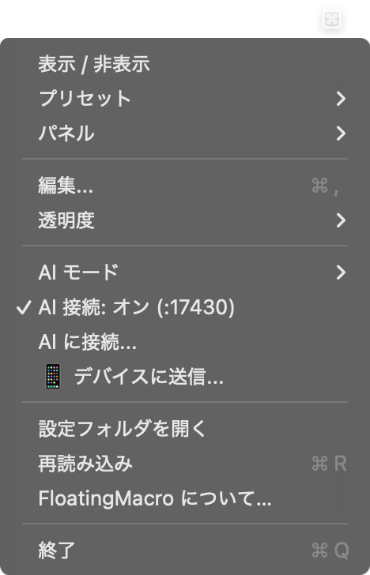
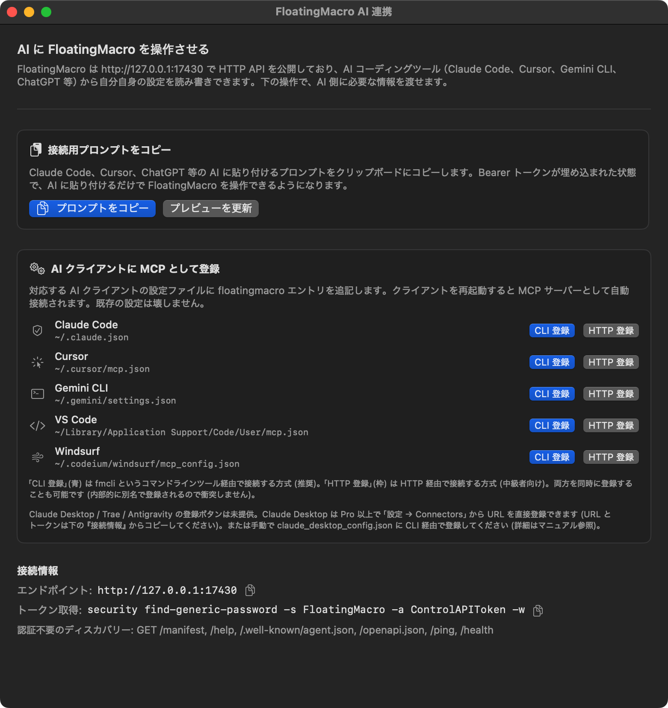
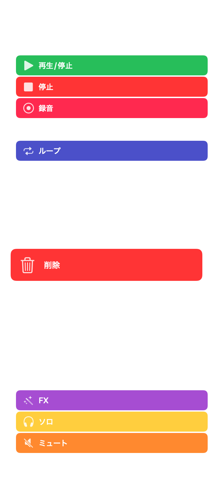

# FloatingMacro ユーザーマニュアル（応用編：AI 連携）

> AI にざっくり伝えてまとめて作らせる、自分で整える — ボタンを一個ずつ作る手間がなくなります。

---

## この文書について

基本編では、手動でボタンを作って使う方法を説明しました。
この応用編では、AI エージェント（Claude Code、Gemini CLI など）に FloatingMacro を操作させる方法を紹介します。

ショートカットボタンを手で作ろうとすると、まずアプリのショートカット一覧を調べて、ボタンを一個ずつ作って、アイコンを選んで、アクションを設定して…と意外に手間がかかります。

AI なら「Illustrator 用のショートカットパネルを作って」とざっくり伝えるだけで、まとめて作ってくれます。ブログ用のハッシュタグも同じで、自分の note.com の URL を教えて「よく使ってるハッシュタグをボタンにして」と頼めばそれだけでやってくれます。あとは要らないものを削ったり、気に入らない表記を直したりして整えるだけです。

---

## AI を接続する

メニューバーの FloatingMacro アイコンをクリックし、「AI に接続...」を選びます。

AI 連携の設定画面が開きます。

**すぐ使いたいとき:** 「接続用プロンプトをコピー」→ AI のチャットに貼り付ける。トークン込みのプロンプトがコピーされるので、貼り付けるだけで AI が FloatingMacro を認識します。

**常時接続したいとき:** 「AI クライアントに MCP として登録」で使っているツールの「CLI 登録」ボタンを押す。Claude Code、Cursor、Gemini CLI、VS Code、Windsurf に対応しています。

---

## 使い方 1: プロンプトパレットを AI に作らせる

MidJourney や Stable Diffusion で使うプロンプトのパーツ — スタイルタグ、アスペクト比、パラメータ。これをボタンとして登録する作業を AI に任せます。

> 「MidJourney 用に、日本画風のスタイルタグを 6 個作って。カード表示で、それぞれ簡単な説明付き」

### 画面で起きること

1. 新しいグループ「日本画スタイル」が作られる
2. 「浮世絵」「水墨画」「琳派」「大和絵」「障壁画」「現代日本画」の 6 枚のカードが並ぶ
3. 各カードに絵文字アイコンとスタイルの説明が付く
4. ボタンを押すと、対応するプロンプトテキスト（`ukiyo-e style, woodblock print aesthetic, ...`）が入力欄に挿入される

ボタンを 1 つずつ作ってラベルやテキストを入力する手間が省けます。

### 応用: 既存のプロンプトを読み込ませる

テキストファイルやメモに溜めていたプロンプト集がある場合:

> 「このテキストファイルのプロンプトを全部ボタンにして、カテゴリごとにグループ分けして」

AI がテキストを解析し、分類してグループ・ボタンを一括作成します。

---

## 使い方 2: パネルのレイアウトを AI に調整させる

パネルの位置・サイズ・透明度をドラッグで合わせるのが面倒なとき、AI に任せます。

> 「パネルを画面の右端に寄せて、幅は狭めで、透明度を 50% にして」

### 画面で起きること

1. パネルが画面右端に移動する
2. 幅がコンパクトに調整される
3. 半透明になり、背後のウィンドウが透けて見える

### マルチパネルの配置

複数パネルを使っているときも:

> 「ショートカット用パネルは左下に小さく、プロンプト用パネルは右半分に大きく表示して」

AI が各パネルの位置・サイズを個別に調整します。

---

## 使い方 3: 既存のプリセットを編集する

ボタンの並び順を変えたい、色を揃えたい、不要なボタンを消したい — Settings 画面を開かなくても、AI に伝えるだけで済みます。

> 「トランスポートグループのボタンを、再生/停止を先頭にして、色を青系に統一して」

### 画面で起きること

1. トランスポートグループ内のボタンが並び替わる
2. 各ボタンの背景色が青系のグラデーションに変わる

> 「使ってないグループは畳んでおいて」

AI がグループを折りたたみ、パネルがすっきりします。

---

## 使い方 4: プリセットを丸ごと作ってもらう

新しい用途のプリセットをゼロから作るのも AI の得意分野です。

> 「REAPER 用のショートカットプリセットを作って。トランスポート、編集、ミキサーの 3 グループで」

### 画面で起きること

1. 「REAPER」プリセットが新規作成される
2. 3 つのグループにそれぞれショートカットボタンが配置される
3. パネルがそのプリセットに切り替わる

AI は DAW やエディタの一般的なショートカットを知っているので、適切なキーバインドを自動で設定します。独自のキーバインドがあれば、伝えれば合わせてくれます。

---

## AI 連携の仕組み（知りたい人向け）

FloatingMacro は HTTP API（Control API）を内蔵しています。AI エージェントはこの API 経由でボタンの追加・プリセットの切替・パネルの移動などを実行します。

通信はすべて Mac の中（localhost）で完結し、インターネットには出ません。認証トークンで保護されているため、許可した AI だけが操作できます。

技術的な詳細は [AI Agent Protocol Manual](AI_PROTOCOL.md) を参照してください。

---

## 対応している AI クライアント

| AI クライアント | 接続方法 |
|---|---|
| Claude Code | AI 連携画面からワンクリックで MCP 登録 |
| Cursor | 同上 |
| Gemini CLI | 同上 |
| VS Code (Copilot) | 同上 |
| Windsurf | 同上 |
| その他 | 接続用プロンプトを貼り付け |

---

## まとめ

AI 連携でできること:

- **ボタンの一括生成** — プロンプトパレットやショートカット集を AI に作らせる
- **レイアウト調整** — パネルの位置・サイズ・透明度を自然言語で指定
- **プリセットの編集** — 並び替え・色変更・グループ整理を会話で
- **新規プリセット作成** — 用途を伝えるだけで AI がゼロから構築

どれも「AI に接続して、やりたいことを伝える」だけです。

---

*FloatingMacro v0.16.4 — MIT License — [GitHub](https://github.com/veltrea/floating-macro)*
