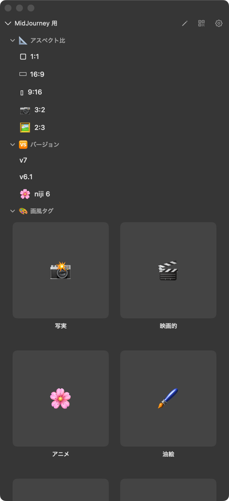
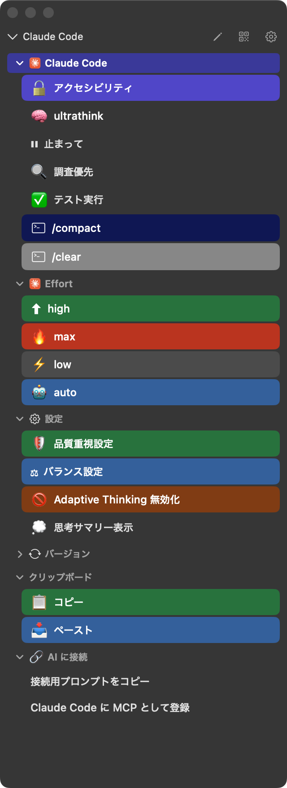
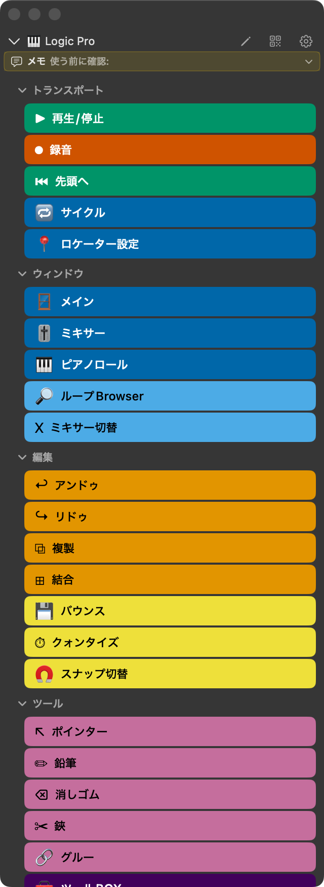
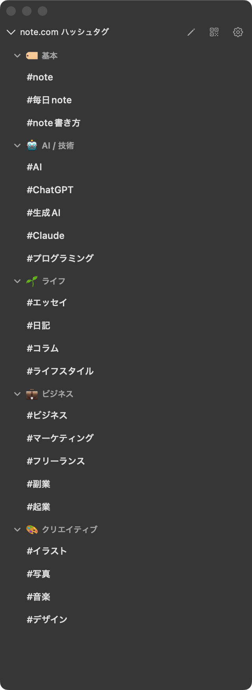
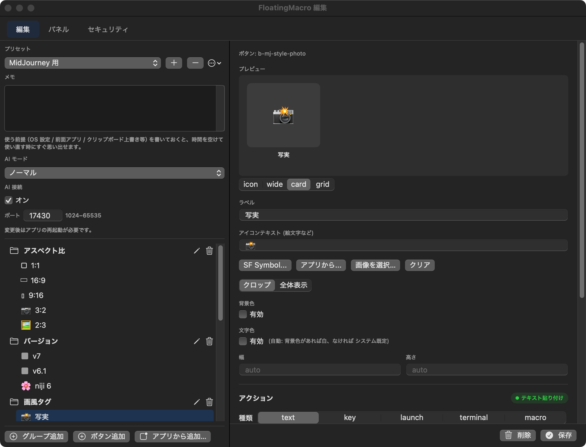

# FloatingMacro ユーザーマニュアル（基本編）

> Mac のデスクトップに常駐する、小さなボタンパネル。
> クリックするだけでテキスト挿入・キーボードショートカット送出・アプリ起動ができます。

---

## 1. FloatingMacro とは

FloatingMacro は macOS 用のフローティングパネルアプリです。
画面の好きな場所に小さなパネルを置いて、ボタンを押すだけで決まった操作を実行します。

ボタンにできることは大きく 4 つ:

- **テキストを挿入する** — 定型文やハッシュタグ、AI 用プロンプトのパーツなど
- **キーボードショートカットを送る** — Cmd+S、F5、Ctrl+Shift+M など
- **アプリや URL を開く** — Slack、ブラウザ、特定のフォルダなど
- **ターミナルでコマンドを実行する** — 開発者向け

「どれか 1 つの使い方を覚えるだけで、もう便利」という設計です。
全部覚える必要はありません。自分に合う使い方を見つけてください。



---

## 2. インストールと初回起動

### ダウンロード

[GitHub のリリースページ](https://github.com/veltrea/floating-macro/releases/latest) から DMG ファイルをダウンロードして、FloatingMacro.app を `/Applications` にドラッグしてください。

### 初回起動

1. FloatingMacro.app をダブルクリック
2. macOS から「アクセシビリティ」の権限を求められます。**これは必須です** — キーボードショートカットの送出やテキスト挿入に必要です
3. 「システム設定 → プライバシーとセキュリティ → アクセシビリティ」で FloatingMacro にチェックを入れます
4. パネルが画面に表示されれば成功です

> パネルの下に「アクセシビリティ権限が無効」と表示される場合は、「修復」ボタンを押してください。

### メニューバー

FloatingMacro は起動するとメニューバーに常駐します。メニューバーのアイコンから以下の操作ができます:

| ブロック | 項目 |
|---|---|
| 表示・切替 | 表示/非表示、プリセット切替、パネル管理 |
| 設定 | 編集…（⌘,）、透明度 |
| AI | AI モード、Control API 有効/無効、AI に接続、📱 デバイスに送信 |
| システム | 設定フォルダを開く、再読み込み（⌘R）、FloatingMacro について |
| 終了 | 終了（⌘Q） |

---

## 3. 画面の見かた

### フローティングパネル



パネルは以下の要素で構成されています:

- **タイトル** — 現在のプリセット名（左上）
- **ペンアイコン** — Settings（編集画面）を開く
- **QR アイコン** — スマホ接続用の QR コードを表示
- **歯車アイコン** — パネル設定（透明度、背景色など）
- **グループ** — ボタンをまとめる折りたたみセクション（「トランスポート」「画風タグ」など）
- **ボタン** — クリックすると設定されたアクションを実行

パネルは常に最前面に表示されます。他のウィンドウの上に浮いているので、作業中でもすぐ使えます。キーボードのフォーカスを奪わないので、テキスト入力中にパネルのボタンを押しても、カーソル位置は変わりません。

### ボタンの表示タイプ

グループには 4 つの表示タイプがあります:

- **ノーマル（icon）**（デフォルト） — テキストラベルが横に並ぶコンパクトな表示
- **ワイド（wide）** — 幅いっぱいに広がるボタン。色分けすると見やすい
- **カード（card）** — 大きなカード形式。画像付きのプロンプトギャラリーに最適
- **グリッド（grid）** — Finder や Launchpad のようなアイコン並び。アプリランチャーに最適




グループごとに列数（auto / 1〜3列）、アイコンサイズ（small / medium / large / xlarge）、ラベルの表示/非表示を個別に設定できます。

### 右クリックメニュー

ボタンやグループヘッダを右クリックすると操作メニューが表示されます:

- **ボタン** — 切り取り / コピー / 貼り付け / 複製 / 編集… / 新規ボタンを追加 / 削除
- **グループ** — 切り取り / コピー / 貼り付け / 複製 / 編集… / ボタンを貼り付け / 削除

コピーしたボタンやグループは、別のパネルに貼り付けることもできます。

---

## 4. 画像生成のお供として使う

画像生成（MidJourney、Stable Diffusion など）をやっている方に、FloatingMacro が一番刺さる使い方です。

### 何がうれしいか

画像生成のプロンプトは、毎回似たようなパラメータを手打ちしがちです:

```
photorealistic, cinematic lighting, --ar 16:9 --v 6.1 --s 250
```

FloatingMacro を使えば、Discord や Web UI のプロンプト入力欄にカーソルを置いて、パネルのボタンをぽちぽち押すだけ。テキストが目の前で入力されていくので、組み合わせを確認しながら作れます。

### 使い方

1. Discord（MidJourney）や画像生成 Web UI を開く
2. プロンプト入力欄にカーソルを置く
3. FloatingMacro のパネルで「MidJourney 用」プリセットに切り替える
4. ボタンを順番に押していく:
   - 画風タグ（写実、アニメ、水彩など）
   - アスペクト比（16:9、1:1 など）
   - バージョン（v6.1、niji 6 など）
   - パラメータ（Style、Chaos、Quality）
   - 必要なら除外指定（ぼかし無、人物無など）
5. 入力欄にプロンプトが組み上がっているので、あとは Enter で送信

### 付属の MidJourney プリセット

FloatingMacro には MidJourney 用のプリセットが最初から入っています:

| グループ | 内容 | 表示タイプ |
|---|---|---|
| アスペクト比 | 1:1 / 16:9 / 9:16 / 3:2 / 2:3 | ノーマル |
| バージョン | v6.1 / niji 6 / v5.2 | ノーマル |
| 画風タグ | 写実 / 映画的 / アニメ / 油絵 / 水彩 / コンセプト | カード |
| パラメータ | Style 0〜750 / Chaos 25 / Quality 2 | ノーマル |
| 除外指定 | ぼかし無 / 人物無 / 文字無 | ノーマル |

もちろん、自分でボタンを追加・編集できます。よく使うプロンプトの断片をボタンにしておけば、次からはクリックだけです。

---

## 5. テキスト挿入ユーティリティとして使う

ハッシュタグ、定型文、メールの署名、コードスニペット — 繰り返し入力するテキストはぜんぶボタンにできます。

### 使い方

1. テキストを入力したいアプリ（note.com、メール、チャットなど）を開く
2. 入力欄にカーソルを置く
3. パネルのボタンを押す → テキストが挿入される

ボタンを押すと、クリップボード経由でテキストが貼り付けられます。元のクリップボード内容は自動で復元されるので、作業中のコピペに影響しません。

### 追記モード（プロンプトビルダー）

ボタンに「追記モード」を設定すると、クリップボードに貼り付けずにテキストをクリップボード上で連結していきます。複数のボタンを順に押してプロンプトの断片を積み上げ、最後に Cmd+V で一括貼り付け — という使い方ができます。

### 付属のハッシュタグプリセット



note.com に記事を投稿するとき、ハッシュタグを毎回手打ちするのは面倒です。このプリセットでは、カテゴリ別にタグがボタンになっています:

- **基本** — #note、#毎日note、#note書き方
- **AI / 技術** — #AI、#ChatGPT、#生成AI、#Claude、#プログラミング
- **ライフ** — #エッセイ、#日記、#コラム、#ライフスタイル
- **ビジネス** — #ビジネス、#マーケティング、#フリーランス、#副業、#起業
- **クリエイティブ** — #イラスト、#写真、#音楽、#デザイン

記事のタグ入力欄にカーソルを置いて、該当するタグを順番にクリック。それだけです。

### 自分の定型文を作るには

Settings 画面でボタンを追加して、アクションタイプを「テキスト」にして、挿入したいテキストを入力するだけです。詳しくは「8. 自分のボタンを作る」を読んでください。

---

## 6. アプリランチャーとして使う

「仕事を始めるとき、毎回同じ 5 つのアプリを起動する」

そういうルーティンがあるなら、FloatingMacro にまとめておくと便利です。

### 使い方

ボタンのアクションを「起動」に設定すると、以下を開けます:

- **アプリ** — Slack、Chrome、Logic Pro など
- **URL** — https://... で始まる Web ページ
- **フォルダ** — Finder で特定のフォルダを開く

ボタンを上から順番にクリックしていけば、作業環境が整います。

### ドラッグ&ドロップでボタンを作る

アプリやファイルをパネルにドラッグ&ドロップすると、起動ボタンが自動生成されます。アイコンも自動で取得されるので、見た目もすぐ整います。複数のアプリをまとめてドロップすれば一括登録できます。

### アプリピッカーから選ぶ

Settings 画面の「アプリから追加…」ボタンを押すと、Mac にインストールされているアプリが Launchpad 風のグリッドで表示されます。アプリ名や Bundle ID で検索でき、ダブルクリックで起動ボタンとして追加できます。

### 組み合わせ例

**「制作モード」プリセット:**
1. Logic Pro を起動
2. REAPER を起動
3. プロジェクトフォルダを Finder で開く
4. リファレンス用の YouTube ページを開く

**「執筆モード」プリセット:**
1. note.com の記事作成ページを開く
2. 資料フォルダを開く
3. 集中用の BGM アプリを起動

---

## 7. ショートカットキーランチャーとして使う

DAW（Logic Pro、REAPER、Studio One など）やデザインツールで、キーボードショートカットをボタンに割り当てます。

### 何がうれしいか

DAW のショートカットは何十個もあって覚えきれません。FloatingMacro に並べておけば、ボタンのラベルを見て押すだけ。色分けすれば、どのグループの操作かも一目瞭然です。


### 付属の Logic Pro プリセット

| グループ | ボタン |
|---|---|
| トランスポート | 再生/停止、録音、先頭へ、サイクル、ロケーター設定 |
| ウィンドウ | メイン、ミキサー、ピアノロール、ループBrowser、ミキサー切替 |
| 編集 | アンドゥ、リドゥ、複製、結合、バウンス、クォンタイズ、スナップ切替 |
| ツール | ポインター、鉛筆、消しゴム、鋏、グルー、ツールBOX |

REAPER、Studio One 用のプリセットも同様に用意されています。

### 使い方

1. 対象アプリ（Logic Pro など）を前面にする
2. パネルのボタンを押す → そのアプリにキーボードショートカットが送られる

注意: キーボードショートカットの送出にはアクセシビリティ権限が必要です。パネル下部に警告が出ている場合は「修復」を押してください。

---

## 8. 自分のボタンを作る

### Settings 画面の開き方

以下のどれでも開けます:
- パネル右上のペンアイコン
- メニューバー → 「編集…」
- キーボードショートカット ⌘,



### 画面の構成

Settings 画面は左ペインと右ペインに分かれています:

**左ペイン:**
- プリセット選択（ドロップダウン）
- メモ欄（そのプリセットの使い方メモ）
- Control API の設定（ポート番号、トークン）
- グループとボタンのツリー表示

**右ペイン:**
- 選択中のボタンまたはグループの編集エリア
- レイアウトプレビュー（icon / wide / card / grid を切り替えて確認できる）
- ラベル、画像選択、アクション設定

### ボタンを追加する

1. 左ペイン下部の「ボタン追加 +」をクリック
2. 右ペインで編集:
   - **ラベル** — ボタンに表示するテキスト
   - **絵文字** — 絵文字テキスト（画像と排他。一方を設定するともう一方は自動クリア）
   - **画像** — 「画像を選択」から SF Symbol、Lucide アイコン、アプリアイコン、ファイルを選択
   - **アクションタイプ** — テキスト / キー / 起動 / ターミナル / ディレイ / マクロ
   - **アクションの内容** — タイプに応じた設定
3. 右ペイン下部の「保存」で確定

### レイアウトプレビュー

ボタン編集画面にはレイアウト切替タブ（icon / wide / card / grid）があり、そのボタンが各レイアウトでどう見えるか確認できます。プレビュー中のレイアウトが実際のグループ設定と異なる場合は「グループに適用」ボタンが表示され、クリックするとグループの表示タイプが変更されます。

### グループを追加する

1. 左ペイン下部の「グループ +」をクリック（「新グループ」が作成される）
2. 行の鉛筆ボタンでリネーム
3. 右ペインのグループ編集で表示タイプ・列数・アイコンサイズ・ラベル表示を設定

### プリセットを追加する

Settings のプリセットドロップダウン横の「+」から新規作成できます。

### ドラッグ&ドロップで並べ替え

左ペインのグループやボタンは、ドラッグ&ドロップで順番を変えられます。ボタンを別のグループにドラッグして移動することもできます。

---

## 9. アイコンのカスタマイズ

ボタンには 4 種類のアイコンを設定できます:

### Lucide アイコン（1700 種以上）

オープンソースの SVG アイコンセット。Settings の画像選択で検索できます。

### SF Symbols

Apple が提供するシステムアイコン。6000 種以上。Settings の画像選択から「SF Symbol...」で選べます。

### アプリアイコン

「アプリから…」ボタンで、Mac にインストールされているアプリのアイコンを自動取得します。起動アクションのボタンに最適です。起動アクションのボタンは、アイコンを設定しなくても起動対象のアプリアイコンが自動で表示されます。

### 絵文字

アイコンの代わりに絵文字テキストも使えます。MidJourney プリセットのように、視覚的にわかりやすいラベルになります。絵文字と画像は排他で、一方を設定するともう一方は自動的にクリアされます。

---

## 10. もっと使いこなす

### マルチパネル

パネルは複数同時に表示できます。メニューバーの「パネル」→「新しいパネルを追加」で追加。

- パネルごとに別のプリセットを表示
- パネルごとに位置・サイズ・透明度を個別設定
- 「MidJourney のパラメータ」と「画風タグ」を別パネルに分けて並べる、といった使い方

### Edge Dock（画面端に収納）

パネルを画面の端にドラッグすると、薄いバー（ドックバー）として収納されます。

- 画面端に近づけるとドッキングのガイドが表示される
- ドックバーをダブルクリックするとパネルが展開
- 再度ダブルクリック、またはパネル外をクリックで収納
- 上下左右どの辺にもドッキング可能
- ドックバーはドラッグで移動でき、位置は記憶される
- パネルの × ボタンで丸アイコンに折りたたみ、黄色ボタンで Edge Dock

パネルが迷子になったら、メニューバーの「パネル」→「位置をリセット」または「ドックバーを集める」で復帰できます。

### Web Panel（スマホから操作）

同じ Wi-Fi に接続しているスマホやタブレットから、ブラウザ経由でパネルを操作できます。

1. パネルの QR アイコンをクリック
2. スマホのカメラで QR コードをスキャン
3. ブラウザでパネルが開く — ボタンをタップすると Mac 側で実行される

Stream Deck のソフトキーのような使い方ができます。

### パネル背景色

パネルの背景色をプリセット単位で変更できます。パネルの右クリックメニュー「背景色」から選択するか、Settings 画面のパネルタブでカラーピッカーから指定できます。

### 見た目のカスタマイズ

- **透明度** — メニューバーまたはパネルの歯車アイコンから調整（25% / 50% / 75% / 100%）
- **背景色** — パネルごとに背景色を変更可能
- **サイズ** — パネルの端をドラッグしてリサイズ

### プリセットの共有

プリセットは JSON ファイルとしてエクスポート/インポートできます。他の人が作ったプリセットを読み込んだり、自分のプリセットを共有できます。プリセットの並び順はメニューバーの右クリック「並べ替え…」で変更できます。

---

## 11. トラブルシューティング

### 「アクセシビリティ権限が無効」と表示される

パネル下部のオレンジ色のバーに「修復」ボタンが表示されます。これを押してください。アプリが再起動し、システム設定が開くので FloatingMacro にチェックを入れます。

macOS のアップデート後にリセットされることがあります。同じ手順で再度有効にしてください。

### ボタンを押してもテキストが入力されない

- 対象アプリの入力欄にカーソルが置かれているか確認してください
- アクセシビリティ権限が有効になっているか確認してください
- 一部のアプリ（特にセキュリティ系）はクリップボード経由の貼り付けをブロックすることがあります

### パネルが画面外に行ってしまった

メニューバーの「パネル」→「位置をリセット」で画面内に戻ります。ドックバーが見つからない場合は「ドックバーを集める」を選んでください。

### ボタンの順番を間違えた

Settings 画面（⌘,）で、左ペインのボタンをドラッグ&ドロップで並べ替えてください。

---

## 動作環境

- macOS 13（Ventura）以降
- Apple Silicon / Intel 両対応
- アクセシビリティ権限（必須）
- 同一 Wi-Fi（Web Panel を使う場合のみ）

---

## 次のステップ

このマニュアルでは FloatingMacro の基本的な使い方を説明しました。

AI エージェント（Claude、ChatGPT、Gemini など）と連携して、ボタン配置を自動生成したり、プリセットを動的に切り替えたりする使い方は「[応用編：AI 連携マニュアル](manual-ai-examples.md)」で解説します。

---

*FloatingMacro v0.16.4 — MIT License — [GitHub](https://github.com/veltrea/floating-macro)*
